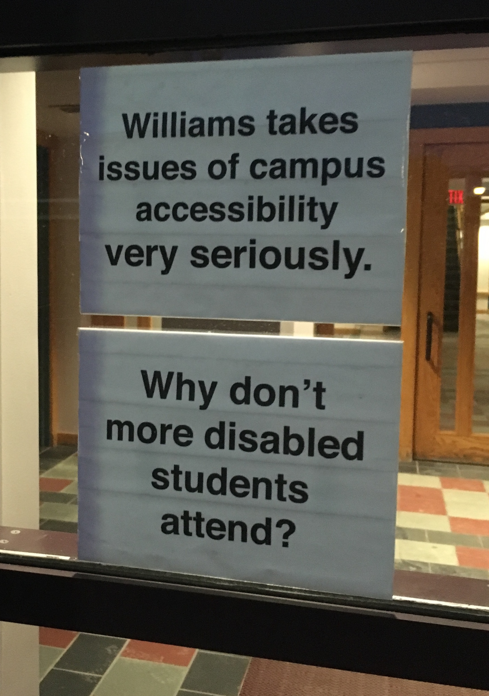
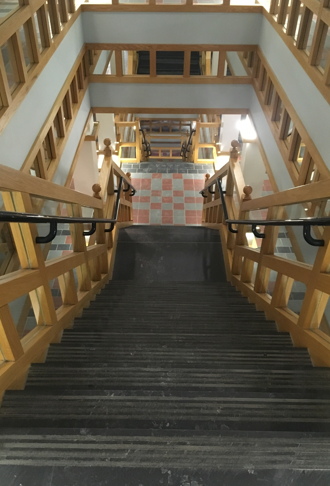
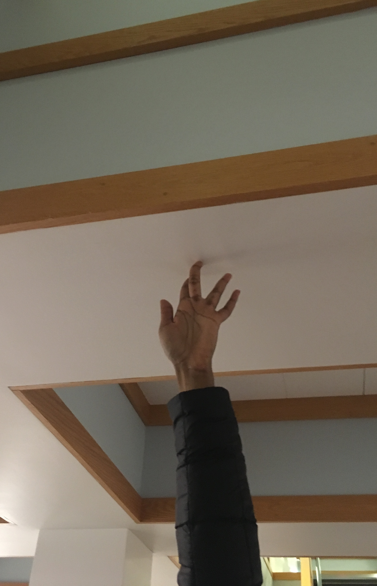

I chose Hopkins because it is an integral building on campus that typically has a reputation for being terribly designed. There was even controversy at one point about how the building is not wheelchair accessible because it would ruin the overall look of the building. Generally, this is an example of a building made for  appearance over use.

After some reflection, Hopkins Hall is an example of bad design for the following reasons:
- It is not wheelchair accessible, despite having some key administrative offices.
- It can be difficult to tell where doors are, given that there are mirrored facades that mimic the doors in the building placed next to said doors.
- Staircases from one floor to the next lead into each other, which could be a safety concern, but is more disconcerting than anything else when someone is on their way down.
- The front of the building has four staircases: two for the 1st floor, and two for the basement. Is this logical? No. Why did they do that? No one knows.
- The upper floors look extremely similar. It can be difficult to differentiate one from another.
- The bottommost floor has low ceilings, so much so that a person of even slightly above average height might feel claustrophobic.
- In some of the classrooms, the chairs are connected to the floor so that they can't move in any direction. They can, however, swivel. Again, why? No one knows.
- Oh, and about the chairs - the ones in the back of the classroom tend to make it difficult for anyone to pass by them, because they are basically right up against the walls.

