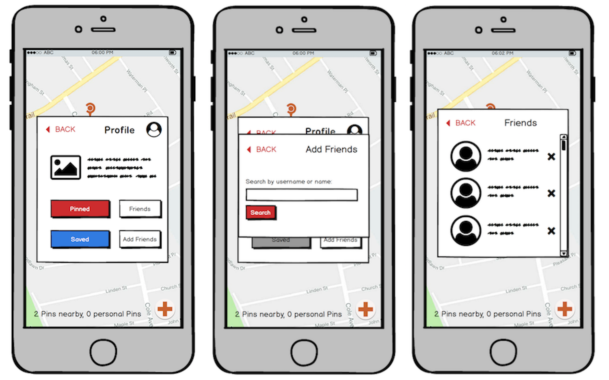
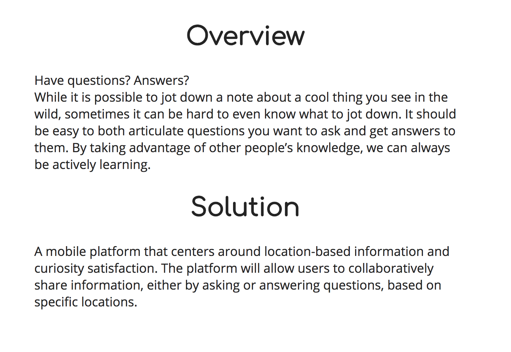
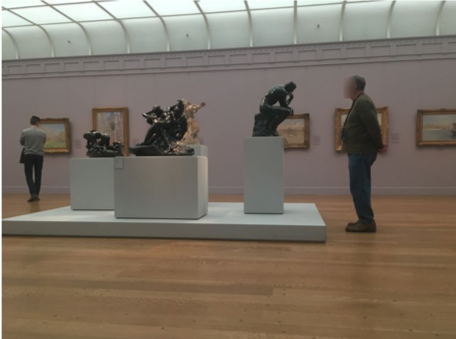
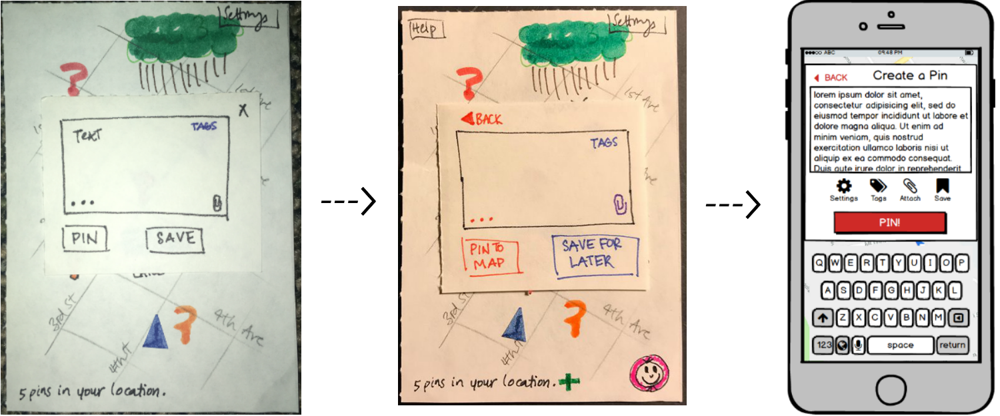

# Overview

Design is a process that should keep the user in mind at all stages of the development of a new product. This means that from the first brainstorming session to the final iteration of a product, designers must ensure that a certain need by a certain group of people is being attended to. Accordingly, this goal requires a focus on a number of main points about the design process. For me, these are the following:

  1. Ethics can ensure that designers maintain clear purposes and goals.
  2. Accessibility helps designers prioritize their users over personal preferences.
  3. Good communication between users and designers identifies problems at the root, not just symptoms.
  4. Iteration through versions of a design weeds out bad ideas and highlights good ones.
  5. Simplicity of design is tied to clarity; the simpler the design, the easier it is to learn, understand, and use.

## Ethics

Ethics has played a significant role in how we chose to design Pin. This is most prominently featured within our discussion around anonymity when posting information. Initially, we were focused only on allowing our users to learn new things while exploring, which tended to steer the conversation towards more questions about implementation. However, we soon realized that in order for users to be able to interact with each other, there would need to be a social aspect in place. But sociality lies on a spectrum—should we allow for full anonymity, similar to [Reddit’s comment system](https://www.linkedin.com/pulse/anonymity-reddit-may-holding-social-network-back-its-thinks-caroline ), should we be aiming to build a more Facebook-esque platform so users can add people they know in real life, or should we try something in between? Naturally, this is an issue of user privacy, which is one of the rights discussed in “The Signal Code” (Harvard Humanitarian Initiative 16).

For starters, it would be unethical for anyone to have full access to anyone else’s information. Our platform is intended to be used as an interactive way for people to learn about the world about them, and is not meant to serve as a form of social media. With this in mind, we are opting towards anonymity, but we also received feedback that indicated interest in being able to interact with people they knew outside of the application. One user during our user tests suggested Snapchat integration, since Snapchat is similar in that it allows people to make posts in the moment about what they are experiencing or doing. This led to the design of a “Friends” feature, which may be appealing to users who would want to make Pins in an area they are familiar with, targeted at people they live near (neighbors, friends, family, etc.). Since this was not the focus of our project, there are still some kinks left to be ironed out--namely, the lack of a “Requests” tab so users can screen other users.

However, we also came across the ethical issue of tracking the location of users, which falls under “The Right to Data Agency” in “The Signal Code” (Harvard Humanitarian Initiative 17-18). This is even more significant today because of the prevalence of location tracking, which has been an issue with Snapchat, Google Maps and Facebook. We should not collect location data for any reason other than for creating Pins, and we do not want other users to be able to find that information. Beyond not storing this data, we wanted to discourage people from connecting their real life to locations and having others aware of their daily routines. As a result, we determined that anonymity was a worthwhile goal for most of our target audience. So, when we were brainstorming our six main tasks, we decided to add “Holding Anonymous Discussions” to our [task list](http://www.lester-lee.com/curious-places//2018/03/05/task_review/ ) and wrote a scenario about a character that would find value in anonymity.

Overall, the incorporation of ethics into our process helped my team and me consider our goals and purposes more carefully, leading to a more benevolent design.

## Accessibility

Accessibility also figured prominently in our design process and our consideration of users. Most recently, when designing our [final website](http://www.lester-lee.com/curious-places/), we took care to ensure that it was responsive to allow for better translation between platforms. We also chose a structure and color scheme that is simple and clear; the page is largely in black and white and there are no items on the main page that are not completely necessary to convey our design. This benefits from being colorblind-friendly and non-distracting for people who might have difficulty focusing on a screen, as described in the “Dos and Don’ts of Designing for Accessibility” (Pun 2-4). Our text is large for people with vision impairment and kept concise for people who use screen readers.

We also considered other designs beyond our smartphone app that were more accessible for vision-impaired individuals. In our ideation phase, [one of our designs](http://www.lester-lee.com/curious-places//2018/03/08/design_checkin/) was a smartwatch app that largely used voice recognition. Since the screen on a smartwatch is small, having alternate methods of input was important, which ultimately made the design more accessible for some users. While we did not select this design because the platform was limited and relatively uncommon, thinking about potential ways that our users might interact with our app definitely guided us to a more universally usable design.

Accessibility helped us focus on our users and simplified our design so that it was clear for everyone. Without keeping this in mind, it’s possible that we would have valued ourselves over our users while developing our idea, but this way we could try to put our users first.

## Communication

User communication occured at all stages of development for Pin. We started with [contextual inquiries](http://www.lester-lee.com/curious-places//2018/02/26/ci_checkin/),where we interviewed and observed a geocacher, a birdwatcher, and visitors at the Clark Art Institute. Having this insight into some potential users was helpful in narrowing down what features we wanted to support most, but it was also crucial in identifying and delving deeper into the problem we were attempting to solve. By talking to people and watching their behavior, we learned that there was nuance to the kinds of questions they asked as they explored and that there were other interesting problems that arose as a result of having these questions (immersion in an experience, for instance).

We also interacted with users when testing our paper prototypes ([heuristic evaluations](http://www.lester-lee.com/curious-places//2018/04/09/heuristic_eval/) and [usability tests](http://www.lester-lee.com/curious-places//2018/04/16/usability_tests/)). We had people sit down with our initial physical design and provide feedback. When we did this, we were able to determine that our design had 1) a number of aesthetic choices that made the navigation confusing and 2) ambiguity in purpose and features. Our users were from different backgrounds, which helped us see a variety of issues that might come up depending on skill level and comfort with technology, especially with a touch screen. Where one of our users understood and completed our tasks in a very short amount of time, another struggled with understanding our interface. These experiences then led us to make changes that we hoped would prevent as much user error as possible, following guidance from “Color and Layout on Small Screens” (from Designing for Small Screens).

All in all, receiving feedback from users for the duration of our design process (from ideation to prototyping) allowed us to pinpoint where we had problems and where our users had problems and find satisfactory solutions, improving the overall design.

## Iteration

There were several iterations of the design, from our initial brainstorm to our final digital prototype. Each iteration was able to bring something better to the final idea and in doing so, also fixed issues that our users commented on. From our [initial paper prototype](http://www.lester-lee.com/curious-places//2018/04/05/old_paper_prototype/) to our [final paper prototype](http://www.lester-lee.com/curious-places//2018/04/05/paper_prototype/), we renamed and made all of our buttons consistent, added a number of alert and dialogue boxes, and added extra features that would support our tasks in more specific situations (a “Help” menu, a “Profile” option to view previously saved tasks, etc.). These are described in our user testing, which can be found [here](http://www.lester-lee.com/curious-places//2018/04/16/usability_tests/). By making these changes, we eliminated some of the confusion that users were encountering when uploading files, making Pins, and interacting with the map.

Then from our final paper prototype to our digital mockup, we made even more changes, which included moving buttons out of the text box, allowing users to view all responses to a Pin at once, and generally cleaning up the interface. These changes kept and improved what users had described positively (obvious imagery and symbols, straightforward screens with few steps, and engagement with the user) while removing more insidious problems (confusion about saving versus posting, deletion of uploaded files, and unclear Pin placement).

Overall, iteration has been very useful for our final design by informing us which ideas were good, and should be retained, and which ideas were unhelpful, and should be removed or improved.

## Simplicity

Our design has always maintained a simplicity that has been key to ensuring Pin was clear and straightforward to use. Our tasks are easy to accomplish within our [digital mockup](http://www.lester-lee.com/curious-places//2018/04/19/digital_mockup/) because the design does not overcomplicate the process of asking or answering a question. Every button has been labeled and we assume minimal technical background for our users, which in turn helps make the design clearer and easier to use for everyone. We also made a point to follow industry standards with our screens (the interface is similar to those of [Reddit](https://www.reddit.com/), [Facebook](https://www.facebook.com/), and [Instagram](https://www.instagram.com/)) so any user of these common platforms would also start off with some familiarity with ours as well. There were no attempts to add fluffy features that would only make our design more confusing for people (in fact, we toned down much of our [initial brainstormed design](http://www.lester-lee.com/curious-places//2018/03/08/design_checkin/) by removing extra modes and screens to make the app more palatable), following the advice of Dix et. al’s “Navigation Design” (Interaction Design 205). As a result, our final design is sleeker and clearer than the design we started with.

In general, having a simple interface will make an application easier to use and clearer to understand, which is helpful for everyone from users to designers. There is no need to add extra details if they do not benefit the users and help them accomplish their goals.

# Conclusion

In summary, ethics will keep a design focused, accessibility prioritizes the user, communication between users and designers finds problems and improves solutions, iteration separates good ideas from bad ones, and simplicity will clarify a design.

This semester has been very informative about what constitutes a good design. Having a good design process is ultimately what will lead to an ideal product, which is one that optimally solves a problem your users have. By gradually expanding our learning during the ideation phase and then narrowing down our ideas in the prototyping phase, I believe that Pin keeps our users in mind and accordingly, it is an ideal product.
